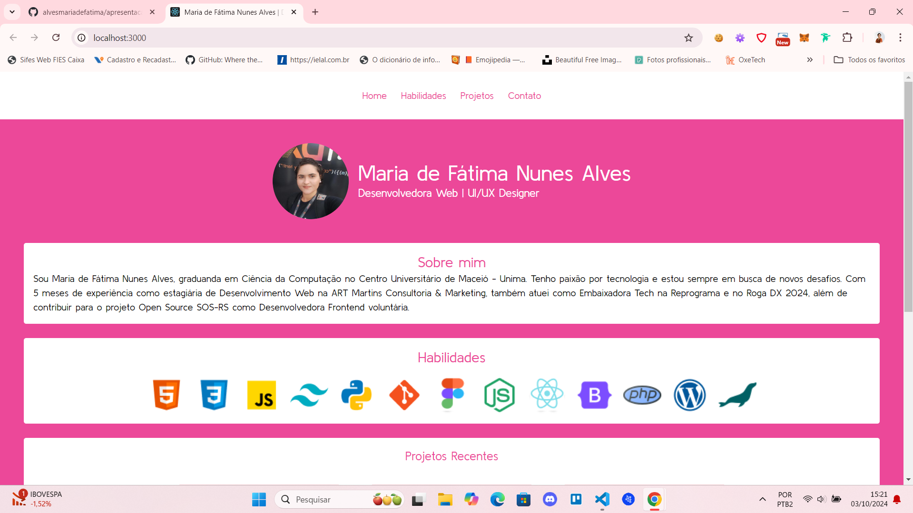
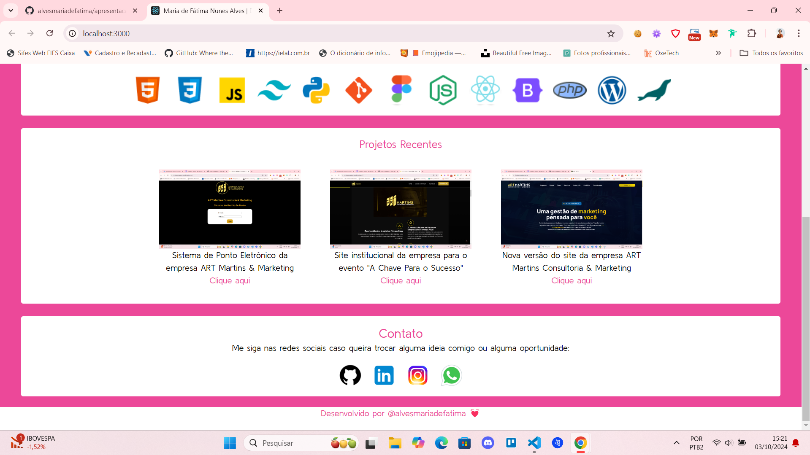

# Desafio 01 - Página de Apresentação Pessoal | Frontend Fusion

Este repositório contém o código do desafio 01 do processo seletivo para a posição de Desenvolvedor Frontend React Júnior Voluntário na Frontend Fusion. O desafio consistiu em desenvolver uma página de apresentação pessoal utilizando **React** e boas práticas de desenvolvimento.

## Visão Geral

O objetivo deste desafio foi desenvolver uma **landing page** de apresentação pessoal que inclua informações relevantes, como minha bio, habilidades técnicas, projetos, e um formulário de contato. A página foi construída utilizando **React** com foco em performance e organização do código.

### Objetivos principais:
- Criar uma página simples, intuitiva e visualmente agradável.
- Aplicar boas práticas de CSS e responsividade.
- Garantir que a página funcione em diferentes dispositivos (desktop e mobile).
- Implementar um formulário funcional que simule o envio de dados.

### Screenshot do projeto:

<br><br>


## Funcionalidades

- **Seção de Apresentação**: Uma breve introdução com nome, foto e descrição.
- **Seção de Habilidades**: Listagem de habilidades técnicas com ícones de tecnologias.
- **Seção de Projetos**: Exibição de projetos anteriores com links para os repositórios no GitHub.
- **Seção de Contato**: Exibição da seção de contatos
- **Responsividade**: O layout foi ajustado para diferentes tamanhos de tela, proporcionando uma experiência otimizada em dispositivos móveis e desktops.

## Tecnologias Utilizadas

- **React**: Biblioteca JavaScript utilizada para criar a interface de usuário.
- **HTML5**: Estrutura semântica da página.
- **Tailwind CSS**: Estilização da página com foco em design responsivo.

## Como Rodar o Projeto

### Pré-requisitos:
- [Node.js](https://nodejs.org/)
- [Git](https://git-scm.com/)

### Passos para rodar o projeto localmente:

1. Clone o repositório:
   ```bash
   git clone https://github.com/seu-usuario/pagina-apresentacao-pessoal.git
   ```

2. Acesse o diretório do projeto:
   ```bash
   cd pagina-apresentacao-pessoal
   ```

3. Instale as dependências:
   ```bash
   npm install
   ```

4. Execute o projeto:
   ```bash
   npm start
   ```

O projeto estará disponível em: [http://localhost:3000](http://localhost:3000)